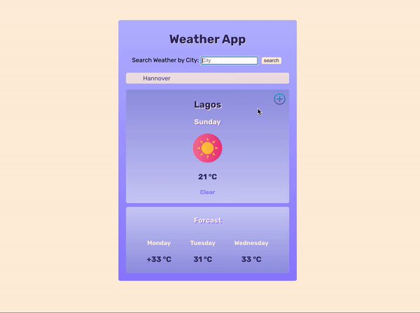

# Weather App

[built with Create-React-App]

- Multi-component web application, with React
- Using API requests to load JSON data into application

# API

https://github.com/robertoduessmann/weather-api 

https://goweather.herokuapp.com/weather/{city}

## Run

- Clone repo
- In terminal:
> npm install

- Run app in browser:
> npm start

## App in action

 
